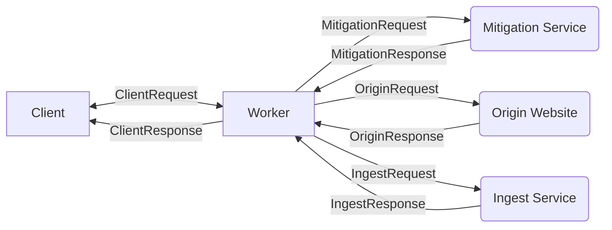

# Netacea Integration Test Runner

This test runner will test any JavaScript integration by treating it as a black box.

## Implementing for a Worker

To implement the test runner for a Worker, all connections to your worker should be stubbed/mocked.

Mocking these dependencies is left to the user of the test runner, as workers and therefore their mocks may vary wildly between implementations.

To maintain consistency and allow the various scenario to be run across all worker implementations, types are provided via `./TestRunner.types.ts` which should be used when communicating results to the test runner. These types should correspond to the requests shown in the above diagram:

-  `ClientRequest`
-  `ClientResponse`
-  `MitigationRequest`
-  `MitigationResponse`
-  `IngestRequest`
-  `IngestResponse`

To implement tests using the runner, import the above types from `@netacea/netaceaintegrationtestrunner` as well as:

-   `runIntegrationTests` - The function which should be called to run the tests. To this you will pass another function, `runWorker`, which should build and run your worker for each test. Since `runWorker` contains the full worker lifecycle you have a large degree of control over how the worker operates. Additionally, integration testing at this level allows for easy refactoring of the worker code, with the tests guarding against regression.
-   `RunWorkerArgs` - The interface for the arguments passed to `runWorker`.
-   `RunWorkerResult` - The interface for the results returned by `runWorker`

## Implementing new test scenarios

Scenarios are defined in the `./scenarios/` folder.
The framework is designed to operate on workers running in any mode and any worker. Therefore test assertions should only be made on behaviours
common to all workers. If there is a compelling reason for a worker implementation to differ in behaviour from the others, then those
differences should be tested within that implementation,
not using this runner.
